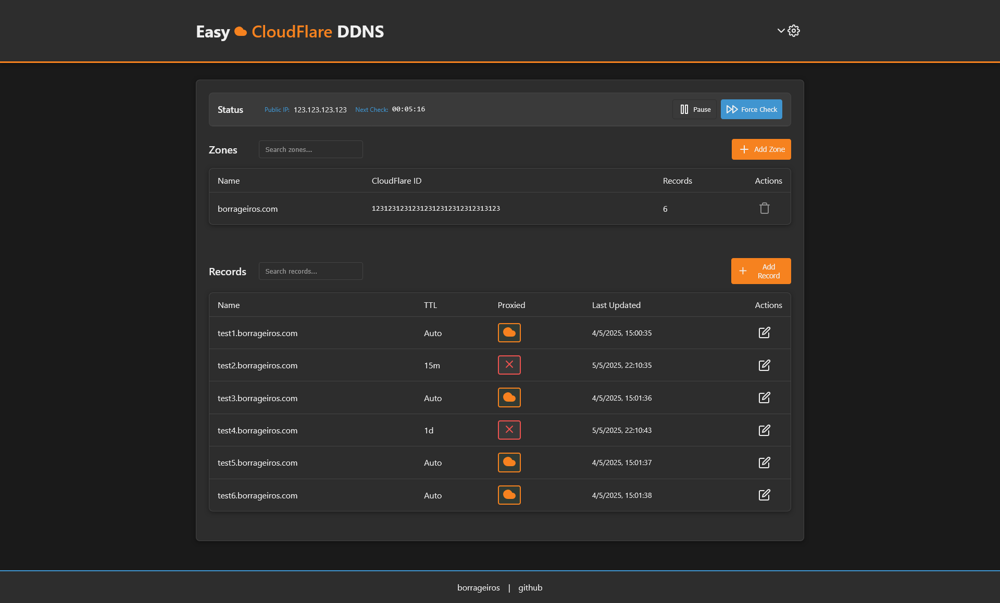

# Easy ☁CloudFlare DDNS

💻 Web Interface - Dynamic DNS service to automatically update CloudFlare records!



# 🚦 Getting Started

Using this application is very simple:

- Start the application, either with Docker (recommended) or with Node.js
- Enter your CloudFlare credentials (email and API key)
- Create as many zones as you want (domains)
- Create as many records as you want (domains or subdomains to update, the same as in the cloudflare table)

The application will periodically (time configurable in minutes) check if your device's public IP has changed. If it has, it will update all the specified records in Cloudflare with the new IP. It's that simple!

# 🐳 Docker

> **You can find 2 previous builds on Docker Hub:**

[Link to DockerHub repository](https://hub.docker.com/repository/docker/borrageiros/easy-cloudflare-ddns/tags)

- **latest**: for amd64 distributions

  ```
  borrageiros/easy-cloudflare-ddns:latest
  ```

- **arm64**: for arm64 distributions (e.g., Raspberry Pi)
  ```
  borrageiros/easy-cloudflare-ddns:arm64
  ```

**(OPTIONAL & RECOMMENDED)  
You must create a folder for persistent storage.**  
This folder will store your data and an auto-generated code to encrypt the password.

```
mkdir /path/to/new/folder
```

- Then you can run the Docker CLI command with this folder and the password you want.

Example command:

```
docker run -d
  --restart on-failure \
  --name=easy-cloudflare-ddns \
  -v /path/to/new/folder:/app/data \
  -p 5173:5173 \
  -e PASSWORD=abc123 \
  borrageiros/easy-cloudflare-ddns
```

## 📡 Api

There is documentation of the api in the /api-docs endpoint:  
http://loalhost:5173/api/docs

You need an api-key (generable from the interface itself)

This can be useful in certain cases, here is an example using [HomePage](https://gethomepage.dev/) to display the general status


## 📝 Node.js Installation

If you want to run the application with Node.js, follow these steps:

#### 🚧 | Prerequisites

- Install -> [Node.js >= 22](https://nodejs.org/en/download/)
- Install -> [Yarn](https://classic.yarnpkg.com/lang/en/docs/install/#windows-stable)

- Install requirements:

```
cd easy-cloudflare-ddns
yarn install
```

- Configure environment variables:  
   Create a `.env` file with the following content:

```
PASSWORD=somepassword123
```

- Run the application:

```
yarn start
```

- Or run in development mode:

```
yarn dev
```

- Custom port:

```
yarn start --port 3000
yarn dev --port 3000
```

## 🔐 Authentication

To enter the interface, you need to set a password.

- The password is set through the `PASSWORD` environment variable
- The application securely stores credentials using encryption with an auto-generated key

To use the API:

- You need to generate an API key through the web interface.
- To use the API, you need to pass the API key in the `Authorization` header with the value `Bearer {api-key}`

## 🛠️ Technologies

This application is built with:

- **Application**: Sveltekit 5
- **Database**: Local json file based storage
- **API**: RESTful API with Swagger documentation
- **Containerization**: Docker support
